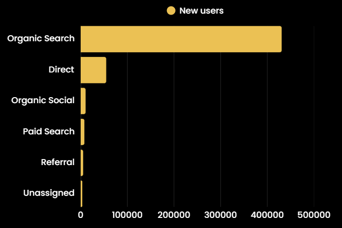
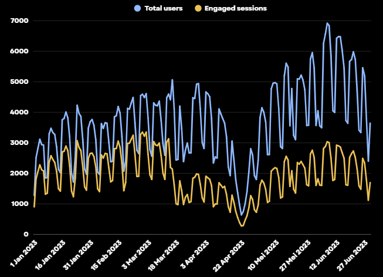
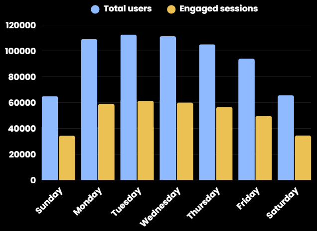
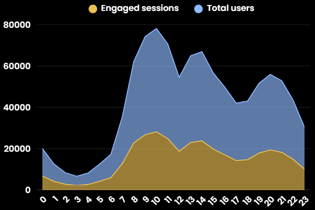
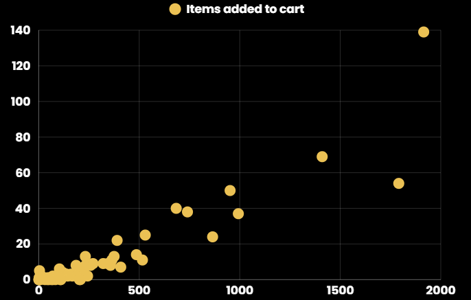
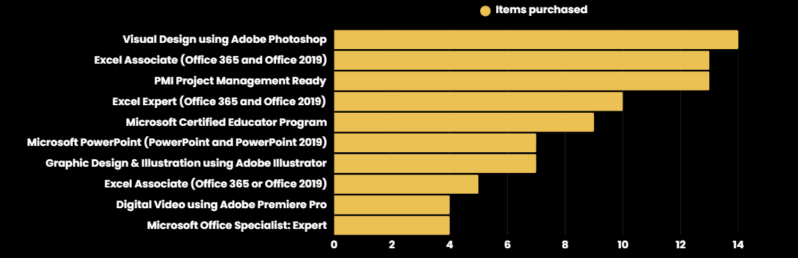
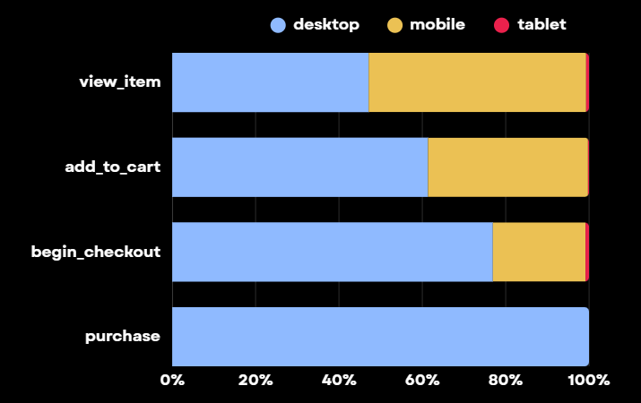

# Case Study: User Behavior Analysis on the MyEduSolve Website
This is a case study from the Capstone Project for the Kampus Merdeka MSIB 6 program at MyEduSolve, Data Analyst Pathway. This project analyzes user behavior on the MyEduSolve website to uncover actionable insights and provide business recommendations.

**Disclaimer:** This repository showcases the analytical process and final conclusions of the project. Due to data confidentiality, the raw dataset and analysis scripts cannot be shared publicly.

## Business Understanding
- **Project Objective:** To identify what kind of user behaviors lead them to engage in purchase-related activities on the MyEduSolve website.
- **Data Source:** MyEduSolve's Google Analytics (Period: January - June 2023).
- **Tools:** Python, Excel, and Looker Studio.

## Insight
**User Acquisition** 

Organic search traffic sources attract the most new users.

**User Engagement**

 

Total users and engaged sessions have weekly seasonal trends, decreased in April, specifically during Eid al-Fitr.

 

Total users and engaged sessions were highest on Tuesday and saw a significant decline over the weekend.

Total users and engaged sessions peak at 9-11 am.

**Product & Purchase**

  

- There is a strong and positive correlation between the number of items viewed and the number of items added to the cart.
- The most purchased item is the Visual Design using Adobe Photoshop certification.

**User Device**

- When viewing items, users mostly use mobile devices.
- However, the majority of users prefer to complete their purchases using a desktop.

## Business Recommendations
- **Optimize SEO Strategy:** To capitalize on the largest source of new users.
- **Focus Marketing Efforts:** Target marketing campaigns on weekdays, especially on Tuesdays between 9 AM and 11 AM.
- **Boost Weekend Engagement:** Offer special promotions or exclusive content on weekends to increase traffic.
- **Enhance UI/UX:** Improve the user interface to enhance the shopping experience on both desktop and mobile, and add a step-by-step guide to simplify the purchase process.
